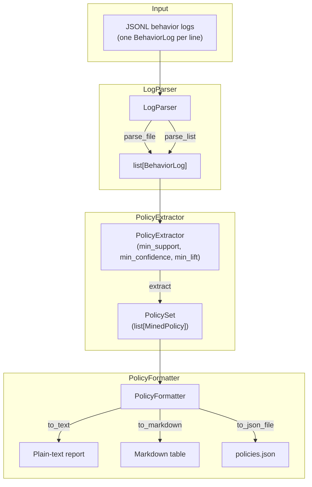

# aumai-policyminer

> Extract governance policies from agent behavior logs

[](https://github.com/aumai/aumai-policyminer/actions)
[](https://pypi.org/project/aumai-policyminer/)
[](LICENSE)
[](https://python.org)

> **Experimental.** Policy mining from behavioral data is an active research
> area. Extracted policies should be reviewed by a domain expert before being
> used to govern production systems. Support and confidence metrics are
> statistical estimates — they do not imply causal relationships.

---

## What is this? (Plain English)

You have deployed an AI agent. It has been running for weeks, taking thousands
of actions. Somewhere in that log is the answer to the question: "What policies
is this agent actually following?"

Perhaps it turns out that whenever `role=admin` appears in the context, the
agent sends an email 87% of the time. Nobody wrote that as a rule. It just
emerged. Is that the intended behavior? A bug? A security concern?

`aumai-policyminer` surfaces these patterns as explicit, measurable, named
policies:

```
policy_0001: When role='admin', agents perform 'send_email'
             with 87.0% confidence (support=12.0%, lift=3.4)
```

Think of it as a **behavioral auditor**: it reads the transcript of what your
agents have done and writes the rulebook that best explains it.

---

## Why does this matter? (First Principles)

Modern AI agents are complex enough that their emergent behavior often diverges
from their specification. This is the **specification-behavior gap** — a core
safety and governance challenge in agentic AI.

There are two classical approaches to closing this gap:

1. **Write better specs upfront** — expensive, brittle, always incomplete.
2. **Observe and infer** — learn the policy from evidence, then audit it.

`aumai-policyminer` implements the second approach using association rule mining,
a well-understood technique from market basket analysis adapted to the agent
action domain. The key metrics are:

- **Support:** How often does this pattern appear? Low support = rare edge case.
- **Confidence:** Given the antecedent context, how reliably does the agent take
  this action? High confidence = strong behavioral tendency.
- **Lift:** How much more likely is this action given this context vs. baseline?
  Lift > 1 = genuine association, not random co-occurrence.

**Research context:**

- Agrawal & Srikant, "Fast Algorithms for Mining Association Rules" (VLDB 1994)
  — foundational association rule mining
- Amershi et al., "Software Engineering for Machine Learning" (ICSE 2019) —
  monitoring and governance of ML systems
- Leike et al., "Scalable agent alignment via reward modeling" (arXiv 2018) —
  inferring intent from behavior
- Hadfield-Menell et al., "Inverse Reward Design" (NeurIPS 2017) — learning
  intended behavior from observed actions

---

## Architecture



---

## Features

- **JSONL log ingestion** with per-line error tolerance (malformed lines skipped,
  not fatal)
- **Association rule mining** (support / confidence / lift) over context
  key-value pairs
- **Configurable thresholds**: `min_support`, `min_confidence`, `min_lift`
- **Auto-generated human-readable descriptions** for every mined policy
- **Multiple output formats**: plain text, Markdown table, JSON
- **CLI** with `extract` and `format` commands
- **Pydantic v2 models** — strict validation at all boundaries
- **No external ML dependencies** — pure Python standard library + Pydantic

---

## Quick Start

### Installation

```bash
pip install aumai-policyminer
```

Or from source:

```bash
git clone https://github.com/AumAI/aumai-policyminer
cd aumai-policyminer
pip install -e ".[dev]"
```

### 5-minute example

```python
from pathlib import Path
from aumai_policyminer.core import LogParser, PolicyExtractor, PolicyFormatter

# Parse behavior logs from a JSONL file
parser = LogParser()
logs = parser.parse_file(Path("agent_logs.jsonl"))
print(f"Parsed {len(logs)} log entries, skipped {parser.skipped_count}.")

# Mine policies
extractor = PolicyExtractor(min_support=0.05, min_confidence=0.6, min_lift=1.2)
policy_set = extractor.extract(logs, name="My Agent Policies")

# Format and print
formatter = PolicyFormatter()
print(formatter.to_text(policy_set))
```

### Example JSONL log format

Each line must be a valid JSON object matching the `BehaviorLog` schema:

```jsonl
{"log_id": "log_001", "agent_id": "agent_A", "action": "read_file", "context": {"role": "admin", "env": "prod"}, "outcome": "success"}
{"log_id": "log_002", "agent_id": "agent_B", "action": "send_email", "context": {"role": "user", "env": "staging"}, "outcome": "success"}
{"log_id": "log_003", "agent_id": "agent_A", "action": "delete_record", "context": {"role": "admin", "env": "prod"}, "outcome": "denied"}
```

---

## CLI Reference

### `extract` — mine policies from logs

```bash
aumai-policyminer extract \
  --logs agent_logs.jsonl \
  --output policies.json \
  --min-support 0.05 \
  --min-confidence 0.7 \
  --min-lift 1.2 \
  --name "Production Agent Policies Q1"
```

Output:

```
Parsed 1842 valid log entries.
Mined 14 policies.
Saved policy set to policies.json
Policy Set: Production Agent Policies Q1
Source logs: 1842
...
```

| Option | Required | Default | Description |
|---|---|---|---|
| `--logs PATH` | Yes | — | Path to JSONL behavior log file |
| `--output PATH` | No | `policies.json` | Output JSON path |
| `--min-support FLOAT` | No | `0.05` | Minimum support threshold (0-1) |
| `--min-confidence FLOAT` | No | `0.6` | Minimum confidence threshold (0-1) |
| `--min-lift FLOAT` | No | `1.0` | Minimum lift threshold |
| `--name TEXT` | No | `"Mined Policy Set"` | Name for the policy set |

### `format` — render a saved policy set

```bash
# Plain text (default)
aumai-policyminer format --policies policies.json

# Markdown table
aumai-policyminer format --policies policies.json --output-format markdown

# Raw JSON
aumai-policyminer format --policies policies.json --output-format json
```

| Option | Required | Default | Description |
|---|---|---|---|
| `--policies PATH` | Yes | — | Path to saved JSON policy set |
| `--output-format` | No | `text` | `text`, `markdown`, or `json` |
| `--max-policies INT` | No | `50` | Maximum policies to render |

---

## Python API Examples

### Parsing logs from Python dicts

```python
from aumai_policyminer.core import LogParser

parser = LogParser()
raw_records = [
    {
        "log_id": "l1",
        "agent_id": "agent_A",
        "action": "approve_request",
        "context": {"role": "manager", "request_type": "budget"},
    },
    {
        "log_id": "l2",
        "agent_id": "agent_B",
        "action": "escalate",
        "context": {"role": "analyst", "request_type": "budget"},
    },
]
logs = parser.parse_list(raw_records)
```

### Mining with custom thresholds

```python
from aumai_policyminer.core import PolicyExtractor

extractor = PolicyExtractor(
    min_support=0.02,     # at least 2% of all logs
    min_confidence=0.75,  # action happens 75% of the time in this context
    min_lift=2.0,         # at least 2x more likely than random
)
policy_set = extractor.extract(logs, name="High-confidence Policies")

# Show top 5 by confidence
for policy in policy_set.top_policies(5):
    print(f"{policy.policy_id}: {policy.description}")
```

### Rendering to Markdown

```python
from aumai_policyminer.core import PolicyFormatter
from pathlib import Path

formatter = PolicyFormatter()

# Print Markdown
print(formatter.to_markdown(policy_set, max_policies=30))

# Save to JSON for downstream tools
formatter.to_json_file(policy_set, Path("policies.json"))
```

### Iterating over policies

```python
for policy in policy_set.policies:
    print(f"ID:         {policy.policy_id}")
    print(f"Antecedent: {policy.antecedent}")   # e.g. {"role": "admin"}
    print(f"Consequent: {policy.consequent}")   # e.g. "delete_record"
    print(f"Support:    {policy.support:.2%}")
    print(f"Confidence: {policy.confidence:.2%}")
    print(f"Lift:       {policy.lift:.2f}")
    print(f"Description: {policy.description}")
    print()
```

---

## How It Works (Deep Dive)

### Association Rule Mining

The extraction algorithm is a simplified, single-level Apriori over
context-action pairs. The full procedure:

1. **Count action frequencies**: for each unique action in the log, count
   occurrences.
2. **Build co-occurrence counts**: for each `(context_key, context_value,
   action)` triple, count matching log entries.
3. **Compute metrics** for each triple:
   - `support = count(key=val AND action) / total_logs`
   - `confidence = count(key=val AND action) / count(key=val)`
   - `lift = confidence / (count(action) / total_logs)`
4. **Filter** by `min_support`, `min_confidence`, `min_lift`.
5. **Sort** by confidence descending and wrap in a `PolicySet`.

The antecedent is always a single `{key: value}` pair from the log `context`
dictionary. Multi-key antecedents are a planned enhancement.

### Skipped Line Handling

`LogParser` skips malformed lines silently and increments `parser.skipped_count`.
Inspect this counter after parsing to assess data quality:

```python
parser = LogParser()
logs = parser.parse_file(Path("logs.jsonl"))
if parser.skipped_count > 0:
    print(f"Warning: {parser.skipped_count} malformed lines skipped.")
```

---

## Integration with Other AumAI Projects

| Project | Integration point |
|---|---|
| `aumai-neurosymbolic` | Convert `MinedPolicy` objects to `LogicRule` for symbolic reasoning |
| `aumai-reasonflow` | Represent mined policies as inference nodes in a reasoning chain |
| `aumai-specs` | Use `PolicySet` as a behavioral specification for contract checking |
| `aumai-guardrails` | Feed high-confidence policies as hard guardrail rules |

---

## Limitations and Experimental Caveats

- **Correlation, not causation:** high confidence does not imply that the
  context causes the action.
- **Single-key antecedents only:** conjunctive policies (`role=admin AND env=prod`)
  require the upcoming multi-itemset version.
- **Context must be flat:** nested JSON in `context` is serialized to strings
  via `str()` and not recursively expanded.
- **No temporal patterns:** logs are treated as an unordered bag of events.
- **Threshold sensitivity:** results are highly sensitive to threshold choices.
  Always explore the support/confidence distribution for your dataset before
  selecting thresholds.

---

## Documentation

- [Getting Started](docs/getting-started.md)
- [API Reference](docs/api-reference.md)
- [Examples](examples/)
- [Contributing](CONTRIBUTING.md)

---

## AumOS Governance Integration

`aumai-policyminer` operates as a standalone tool. For enterprise-grade
governance, mined `PolicySet` objects can be registered in AumOS to create
versioned, auditable behavioral specifications for deployed agents.

---

## Contributing

We welcome contributions! See [CONTRIBUTING.md](CONTRIBUTING.md).
Run `make lint test` before submitting. Conventional commits:
`feat:`, `fix:`, `refactor:`, `test:`, `docs:`.

---

## License

Apache 2.0 — see [LICENSE](LICENSE) for details.

## Part of AumAI

This project is part of [AumAI](https://github.com/aumai) — open source
infrastructure for the agentic AI era.
